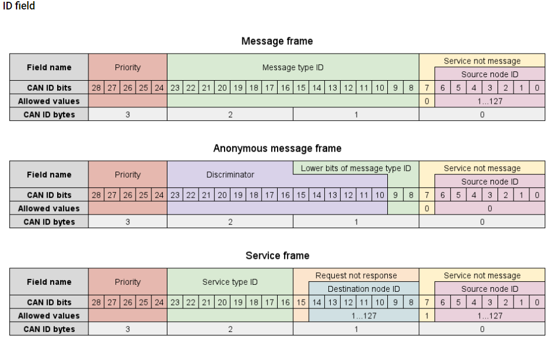
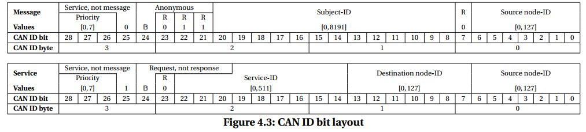
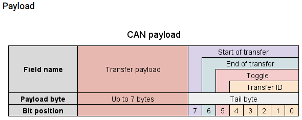
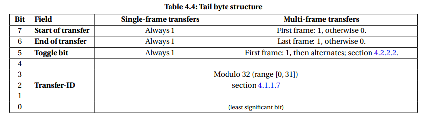

# Cyphal(UAVCAN)协议解析

- @ [Jerrick.Rowe](https://github.com/JerrickRowe) (20231129)

## UAVCAN、DroneCAN、Cyphal的历史

[原UAVCAN V0协议](https://legacy.uavcan.org/)已经归档停止支持；

对于UAVCAN V1版本的发展方向，协议维护团队存在分歧，于2022年分支为两个发展方向，分别是走通用化路线的的[OpenCyphal](https://opencyphal.org/)，和兼容原UAVCAN V0的[DroneCAN](https://dronecan.github.io/)；

[DroneCAN社区关于Cyphal分歧的讨论](https://discuss.ardupilot.org/t/discussion-of-cyphal-support/98016)

## Cyphal协议语意解释

[Cyphal_Specification-UAVCAN-协议文档原文](./Cyphal_Specification-UAVCAN-协议文档.pdf)

Cyphal是基于UAVCAN演变而来的开源通信协议，具有MIT开源许可；

协议设计思想：去中心的PUB/SUB（订阅/发布）机制为主，Service/Request（服务/请求）机制为辅;

### Node节点

在一个Cyphal总线中，并行连接了多个通信对象，每个通信对象都是一个节点。

每个节点分配有一个总线内唯一的节点ID(Node-ID)

节点ID范围：[0~127]

### Anonymous匿名

没有分配节点ID的节点，是匿名节点；匿名状态由[传输层](#传输层)的标志位来实现。

匿名节点只能传输单帧数据类型；

匿名节点只能发送[广播消息](#subject主题)；

通过Cyphal标准定义的即插即用(PnP)协议，可以实现自动向匿名节点分配节点ID功能。

### Subject主题

一个节点可以发布(Publish)消息(Message)到主题和订阅(Subscribe)主题。

节点发布的主题可以被总线中其他所有的节点订阅，也就是说，**主题 ≈ 广播消息**；

一个节点可以发布多个主题，也可以订阅多个主题；

一个主题有一个唯一的(Subject-ID)主题ID，订阅者通过主题ID订阅相应的主题；

| 规定情况                         | 固定/可变 | 主题ID      |
| -------------------------------- | --------- | ----------- |
| Unregulated无规定                | 固定+可变 | [0,6143]    |
| Regulated Vendor已规定的厂商ID   | 固定      | [6144,7167] |
| Regulated Standard已规定的标准ID | 固定      | [7168,8191] |

### Service服务

一个节点可以向另一个节点提供服务。有客户端、服务端两个角色；

客户端向服务端发送Request请求，服务端收到请求并处理后向客户端发送服务消息作为回复;

服务是一对一的，消息中指定了发送方和接收方，总线其他节点会忽略这些请求和服务数据；

一个服务有一个唯一的(Service-ID)服务ID。

| 规定情况                         | 固定/可变 | 服务ID    |
| -------------------------------- | --------- | --------- |
| Unregulated无规定                | 固定+可变 | [0~255]   |
| Regulated Vendor已规定的厂商ID   | 固定      | [256,383] |
| Regulated Standard已规定的标准ID | 固定      | [384,511] |

### Port端口

端口是一个抽象描述，用于统称消息和服务。主题ID和服务ID统称为(Port-ID)端口ID。

### Regulation规定

Cyphal官方维护有一个端口ID分配表，此处翻译为“规定”，详见：[public_regulated_data_types](https://github.com/OpenCyphal/public_regulated_data_types);

分配表由一个dsdl文件树构成，uavcan目录下是标准ID，reg目录下是厂商ID。

### Data type 数据类型

一个主题或一个服务由一个数据类型来定义；

一个数据类型，类似一个C语言结构体，包含不同的字段，多个字段按照1byte对齐，打包成一个结构；节点之间通过同一个打包规则，互相交换数据。

Cyphal标准定义了许多标准的数据类型，包括IS物理量、电压电流、空间向量、四元数等无人机行业常用的数据类型，在定义新类型的时候，可以考虑通过引用已有数据类型的方式，复用标准类型或者自定义数据类型，减少在交互过程中管理物理量刚的需要；当然，通过int，float之类的基本数据类型也能够实现数据类型的定义。

### DSDL

描述 [主题](#subject主题), [服务](#service服务), [请求](#service服务), [数据类型](#data-type-数据类型) 的语言；

DSDL文件作为协议沟通文件，同时具备文档和具体的功能，其功能由[DSDL编译器](https://github.com/OpenCyphal/nunavut)实现；DSDL编译器能根据DSDL文件自动生成多种程序语言的序列化和反序列化代码。

写在一个文本文件中，文件后缀名可以是：\*.uavcan, \*.dsdl。

在[Cyphal V1.0规范](./Cyphal_Specification-UAVCAN-协议文档.pdf)中，规定DSDL文件必须使用\*.dsdl后缀名。

DSDL文件内容包括：消息/服务的名称和ID，协议版本，数据字段定义等内容；特别的，对服务来说，有服务消息定义和请求消息两部分。

详见[原文](./Cyphal_Specification-UAVCAN-协议文档.pdf)**Data structure description language章节**。

### 传输层

Cyphal设计之初基于CAN bus，目前还发展出了UART传输层和UDP/IP传输层，但仍处于beta阶段，建议不要应用到量产产品中。

Cyphal推荐使用CAN FD, 通过更大的包获得更高的传输速率，同时也兼容CAN2.0标准8bytes帧，但CAN FD的普及程度还不高，仅支持8byte包仍然是CAN bus的重要标准定义；开发时，需要权衡升级CAN FD的必要性。

优先级、包类型（服务/话题，请求/回复，匿名）、服务ID、话题ID、节点ID等，会被打包进CAN ID中；

另外，Cyphal协议栈占用CAN负载中的一字节，用于维护Cyphal协议的传输状态，包括头、尾、奇偶位，和5位的传输ID(Transfer-ID)；传输ID需要用户代码介入。

#### 优先级

CAN bus物理层已经有一个通过CAN-ID实现的优先级，基于物理层优先级，Cyphal基于该优先级机制，用CAN-ID中的高3位定义了8级优先级；

| 优先级值 | 优先级名         | 备注                                                        |
| -------- | ---------------- | ----------------------------------------------------------- |
| 0        | 最高 Exceptional | 仅用于急停、自毁、等极度关键指令                            |
| 1        | 立即 Immediate   | 用于需要立即响应的消息/指令，如时间同步等                   |
| 2        | 快   Fast        | 用于时间敏感的消息/指令，计算延迟时只需考虑立即优先级的影响 |
| 3        | 高   High        | 用于重要的消息/指令，如重要的传感器更新                     |
| 4        | 正常 Nominal     | 所有的消息/指令应默认使用此优先级，特别是心跳消息           |
| 5        | 低   Low         | 用于允许一点延迟，但延迟可控的消息/指令                     |
| 6        | 慢   Slow        | 用于时间不敏感的消息/指令                                   |
| 7        | 可选 Optiona     | 仅用于调试目的，交付的软件中不应该使用                      |

## Cyphal工具链

- [nunavut DSDL编译器](https://github.com/OpenCyphal/nunavut)
- [Yukon Cyphal总线可视化调试器](https://github.com/OpenCyphal/yukon)
- [Libcanard 嵌入式协议栈](https://github.com/OpenCyphal/libcanard)

## Cyphal V1 与 UAVCAN V0 不兼容

Cyphal 在传输层上使用了不同的CAN-ID结构，对于UAVCAN V0的数据流，Cyphal无法正确解析帧信息，反之同理。

- UAVCAN V0 CAN-ID结构
    
- Cyphal V1 CAN-ID结构
    

另外Cyphal V1与UAVCAN V0使用了相同的尾字节，因此可能存在异常情况使得双方的流控过程能够通过的情况。

- UAVCAN V0 负载结构
    
- Cyphal V1 尾字节结构
    
